# Phase 0 Baseline and Technical Inventory — `debit_services`

**Target Microservice:** [`debit_services`](file:///D:/pyro/debit_services)  
**Git Branch:** `feature/zonewise-staged-migration`  
**Base Commit:** `492e067 initial commit`  
**Target Rollout Date:** 15 September 2026  
**Implementation Plan Reference:** [`debit_services_final_implementation_plan.md`](file:///D:/pyro/docs/debit_services_final_implementation_plan.md)  
**Date:** 2026-09-07  
**Status:** Complete — Baseline Frozen (Zero Production/Functional Mutations Executed)  
**Deliverable:** `docs/debit_zonewise_baseline.md`  

---

## 1. Executive Summary

This document establishes the authoritative technical baseline and operational inventory for the [`debit_services`](file:///D:/pyro/debit_services) microservice prior to initiating the zonewise staged rollout (`NZ` → `NZ,WZ` → `ALL`).

In strict compliance with **Phase 0 (Baseline Verification)** of the [`debit_services_final_implementation_plan.md`](file:///D:/pyro/docs/debit_services_final_implementation_plan.md), this document records the unmodified source-of-truth implementation:
- The actual runtime execution flow across all entry points (FastAPI lifespan, APScheduler background jobs, and admin operational routes);
- Complete service-by-service data flows for **FancySale**, **SimSwap**, and **ESIM**;
- Exhaustive SQL query inventory (`Q001` through `Q018`), including target tables, projection columns, filter clauses, and bind parameters;
- Status transitions and cross-database state machines for `CAF_ENTRY_DONE`, `AMOUNT_DEDUCT_FLAG`, and `ACTIVATION_STATUS`;
- Database transaction boundaries across Oracle (`oracledb.SessionPool`) and PostgreSQL (`psycopg2.pool.ThreadedConnectionPool`);
- Outbound Pyro telecom gateway integration, 3DES encryption, JWT token management, and error code classification;
- Stuck-record cleanup mechanics and timing race condition analysis;
- Current deployment topology, container configuration, and concurrency characteristics.

**Acceptance Criteria for Phase 0:**
- Zero functional code changes made.
- Current execution flow, queries, state transitions, and boundaries fully documented and frozen.

---

## 2. Codebase Inventory

The `debit_services` codebase is organized as follows:

| Component | File Path | Primary Responsibility |
| :--- | :--- | :--- |
| **Service Entry & Lifespan** | [`main.py`](file:///D:/pyro/debit_services/main.py) | FastAPI app instance (`title="Debit Service"`, `root_path="/smpyro"`), lifespan context manager initializing Oracle and PostgreSQL pools, verifying adapter implementations, pre-warming Pyro tokens, starting APScheduler, exposing `/health` and `/ready`. |
| **Settings & Configuration** | [`app/config.py`](file:///D:/pyro/debit_services/app/config.py) | Pydantic `BaseSettings` (`SettingsConfigDict(env_file=".env", extra="ignore")`) loading Oracle, PostgreSQL, Pyro credentials, timeouts, scheduler flags, and per-service batch/interval/stuck thresholds. |
| **Scheduler Engine** | [`app/scheduler.py`](file:///D:/pyro/debit_services/app/scheduler.py) | APScheduler `AsyncIOScheduler` registering recurring jobs for debit processing (`_debit_job`), stuck record recovery (`_stuck_cleanup_job`), and daily authentication (`_debit_daily_auth_job`). |
| **Admin & Operational API** | [`app/debit/router.py`](file:///D:/pyro/debit_services/app/debit/router.py) | REST routes: `GET /debit/status` (token and adapter status), `POST /admin/trigger-debit/{service_type}` (manual batch trigger), and `POST /admin/reset-stuck-debit/{service_type}` (emergency stuck record reset). |
| **Generic Batch Processor** | [`app/debit/processor.py`](file:///D:/pyro/debit_services/app/debit/processor.py) | Orchestrates the 5-step debit pipeline: `fetch_and_claim()`, `map_to_pyro_params()`, `wallet_adjustment()`, writeback (`mark_success()` or `mark_failed()`), and audit logging. |
| **Adapter Interface Protocol** | [`app/debit/services/base.py`](file:///D:/pyro/debit_services/app/debit/services/base.py) | Defines the `DebitServiceAdapter` protocol requiring: `fetch_and_claim()`, `map_to_pyro_params()`, `get_record_ref()`, `mark_success()`, `mark_failed()`, and `reset_stuck_processing()`. |
| **Service Registry** | [`app/debit/services/registry.py`](file:///D:/pyro/debit_services/app/debit/services/registry.py) | Instantiates concrete adapters in `SERVICE_REGISTRY` dict (`"FANCYSALE"`, `"SIMSWAP"`, `"ESIM"`) with configured token managers, batch sizes, and thresholds. |
| **FancySale Adapter** | [`app/debit/services/fancysale.py`](file:///D:/pyro/debit_services/app/debit/services/fancysale.py) | Implements data access and state transitions against Oracle `CAF_ADMIN.VANITYSALE_FRANCH_DATA` (Q001, Q002, Q003, Q004, Q005). |
| **SimSwap Adapter** | [`app/debit/services/simswap.py`](file:///D:/pyro/debit_services/app/debit/services/simswap.py) | Implements data access and state transitions against Oracle `CAF_ADMIN.SIMSWAP_AMOUNT_DEDUCT_REQUESTS` (Q006, Q007, Q008, Q010, Q011) and secondary update on `CAF_ADMIN.BCD` (Q009). |
| **ESIM Adapter** | [`app/debit/services/esim.py`](file:///D:/pyro/debit_services/app/debit/services/esim.py) | Implements data access and state transitions against Oracle `CAF_ADMIN.SIMSWAP_AMOUNT_DEDUCT_REQUESTS` (Q012, Q013, Q014, Q016, Q017) and secondary update on `CAF_ADMIN.SIM_SWAP_DATA` (Q015). |
| **Token Managers** | [`app/debit/token_managers.py`](file:///D:/pyro/debit_services/app/debit/token_managers.py) | Instantiates `PyroAuthService` for each service (`fancysale_tm`, `simswap_tm`, `esim_tm`) with service-specific login credentials and secret keys. |
| **Pyro Auth Client** | [`app/auth/token_manager.py`](file:///D:/pyro/debit_services/app/auth/token_manager.py) | Manages Pyro 2-tier authentication (`sessionToken`, `accessToken`), parsing JWT `exp` claims with a 60-second buffer, serialized via `asyncio.Lock`. |
| **Pyro Debit HTTP Client** | [`app/debit/pyro_client.py`](file:///D:/pyro/debit_services/app/debit/pyro_client.py) | Executes `POST /erp-stock-api/service-wallet-adjustment` with 3DES-encrypted JSON payloads, handles response parsing, and triggers PostgreSQL audit logging. |
| **PostgreSQL Audit Logger** | [`app/db/debit_log.py`](file:///D:/pyro/debit_services/app/db/debit_log.py) | Provides `insert_debit_txn_log` and `async_insert_debit_txn_log` inserting audit records into PostgreSQL `public.debit_txn_log` (Q018). Masks MPIN to `***`. |
| **Oracle DB Pool** | [`app/db/oracle.py`](file:///D:/pyro/debit_services/app/db/oracle.py) | Manages `cx_Oracle.SessionPool` (min=1, max=5) and exposes `get_oracle_conn()` context manager. |
| **PostgreSQL DB Pool** | [`app/db/postgres.py`](file:///D:/pyro/debit_services/app/db/postgres.py) | Manages `psycopg2.pool.ThreadedConnectionPool` (min=2, max=10) with `@_pg_retry` decorator and auto-reconnect logic. |
| **Security Dependency** | [`app/security.py`](file:///D:/pyro/debit_services/app/security.py) | Implements `require_admin_api_key` checking header `X-Admin-API-Key` against `settings.admin_api_key`. |
| **Encryption Utilities** | [`app/encryption.py`](file:///D:/pyro/debit_services/app/encryption.py) | 3DES ECB PKCS5 encryption/decryption using SHA-1 derived 24-byte key (`_derive_key`). Matches Pyro's Java client format. |
| **Database Schema DDL** | [`sql/debit_txn_log.sql`](file:///D:/pyro/debit_services/sql/debit_txn_log.sql) | DDL for PostgreSQL table `public.debit_txn_log` and associated performance indexes. |

---

## 3. Actual Execution Flows

```mermaid
flowchart TD
    subgraph S1["1. Application Startup (main.py)"]
        A1["Uvicorn Startup Lifespan"] --> A2["Initialize PostgreSQL Pool (min=2, max=10)"]
        A2 --> A3["Initialize Oracle SessionPool (min=1, max=5)"]
        A3 --> A4["Verify SERVICE_REGISTRY (FancySale, SimSwap, ESIM implemented=True)"]
        A4 --> A5["Authenticate Enabled Token Managers via PyroAuthService"]
        A5 --> A6["Start APScheduler (scheduler.py)"]
    end

    subgraph S2["2. Scheduled & Admin Debit Batch Pipeline (processor.py)"]
        B1["APScheduler: _debit_job(service_type)<br/>or Admin: POST /admin/trigger-debit/{service_type}"] --> B2["run_debit_batch(adapter)"]
        B2 --> B3["adapter.fetch_and_claim(batch_size=200)<br/>• Q001 / Q006 / Q012: SELECT candidates<br/>• Q002 / Q007 / Q013: Optimistic UPDATE to 'P'<br/>• Check cur.rowcount == 1<br/>• conn.commit()"]
        B3 --> B4["Sequential Loop over Claimed Records"]
        B4 --> B5["adapter.map_to_pyro_params(record)<br/>• Decrypt/verify MPIN<br/>• Format MSISDNs & clientId"]
        B5 --> B6["pyro_client.wallet_adjustment(...)<br/>• 3DES encrypt payload<br/>• POST /erp-stock-api/service-wallet-adjustment"]
        B6 --> B7["Q018: INSERT public.debit_txn_log (Postgres)"]
        B7 --> B8{"Pyro Response Status"}
        B8 -- "SUCCESS (200, 2000)" --> B9["adapter.mark_success(record, pyro_txn_id, remarks)<br/>• Q003 / Q008 / Q014: UPDATE status='Y'<br/>• [SimSwap]: Q009 UPDATE BCD='AI'<br/>• [ESIM]: Q015 UPDATE SIM_SWAP_DATA='AI'"]
        B8 -- "FAILURE / TIMEOUT" --> B10["adapter.mark_failed(record, remarks)<br/>• Q004 / Q010 / Q016: UPDATE status='R'"]
    end

    subgraph S3["3. Stuck Processing Recovery Pipeline (scheduler.py)"]
        C1["APScheduler: _stuck_cleanup_job (Every 15 min)<br/>or Admin: POST /admin/reset-stuck-debit/{service_type}"] --> C2["adapter.reset_stuck_processing(stuck_minutes=10)"]
        C2 --> C3["Q005 / Q011 / Q017: UPDATE status='N'<br/>WHERE status='P' AND date < SYSDATE - (:stuck_minutes / 1440)"]
    end

    subgraph S4["4. Daily Re-Authentication Pipeline (scheduler.py)"]
        D1["APScheduler: _debit_daily_auth_job (Daily at 00:10 UTC)"] --> D2["Iterate ALL_DEBIT_TOKEN_MANAGERS<br/>tm.authenticate() -> Refresh session & access tokens"]
    end
```



---

## 4. Service-by-Service Operational Matrix

### 4.1 FancySale (`FANCYSALE`)

- **Primary Source Table:** Oracle `CAF_ADMIN.VANITYSALE_FRANCH_DATA` (Physical table, non-partitioned).
- **Primary Row Identifier:** `REFID` (used by queries, but lacks DB unique constraint/index in confirmed metadata).
- **Status Field:** `CAF_ENTRY_DONE` (`'N'`, `'P'`, `'Y'`, `'R'`, `'QM'`, `'QB'`).
- **Timestamp Field:** `CAF_ENTRY_DATE` (set to `SYSDATE` upon claiming).
- **Remarks Field:** `PYRO_REMARKS`.
- **Secondary Updates:** None. `CAF_ADMIN.BCD` is updated independently by BSNL's external scheduled process.
- **Workflow:**
  1. *Discovery (Q001):* Fetches up to `fancysale_batch_size` (default 200) rows where `CAF_ENTRY_DONE IN ('N', 'QM', 'QB')` ordered by `TRANS_DATE ASC`. Decrypts MPIN inline via `CAF_ADMIN.F_DECRYPT(MPIN)`.
  2. *Claim (Q002):* Updates each candidate row individually: `WHERE REFID = :refid AND CAF_ENTRY_DONE IN ('N', 'QM', 'QB')`. Commits all claimed rows at the end of the batch claim loop.
  3. *Dispatch:* Maps `CTOPUPNO` (source MSISDN), `FANCY_NO` (destination MSISDN), `AMOUNT`, and `SS_REQUEST_ID` (client ID). Sends to Pyro.
  4. *Success Writeback (Q003):* Updates `CAF_ENTRY_DONE = 'Y'`, `TRANSACTION_ID = :pyro_txn_id`, `PROCESSED_SM = 'Y'` where `REFID = :refid AND CAF_ENTRY_DONE = 'P'`. Exceptions are swallowed and logged.
  5. *Failure Writeback (Q004):* Updates `CAF_ENTRY_DONE = 'R'` where `REFID = :refid AND CAF_ENTRY_DONE = 'P'`.
  6. *Stuck Cleanup (Q005):* Resets records where `CAF_ENTRY_DONE = 'P'` and `CAF_ENTRY_DATE < SYSDATE - (:stuck_minutes / 1440)` back to `'N'`.

### 4.2 SimSwap (`SIMSWAP`)

- **Primary Source Table:** Oracle `CAF_ADMIN.SIMSWAP_AMOUNT_DEDUCT_REQUESTS` (Physical table, non-partitioned).
- **Primary Row Identifier:** `ID` (Verified Primary Key).
- **Workflow Discriminator:** `MODULE_TYPE = 'SIMSWAP'`.
- **Status Field:** `AMOUNT_DEDUCT_FLAG` (`'N'`, `'P'`, `'Y'`, `'R'`, `'QM'`, `'QB'`).
- **Timestamp Field:** `AMOUNT_DEDUCT_DATE` (set to `SYSDATE` upon claiming and writeback).
- **Remarks Field:** `AMOUNT_DEDUCT_REMARKS`.
- **Secondary Updates:** Oracle `CAF_ADMIN.BCD` (Physical table, PK `(GSMNUMBER, CAF_SERIAL_NO)`).
  ```sql
  UPDATE CAF_ADMIN.BCD SET ACTIVATION_STATUS = 'AI' WHERE GSMNUMBER = :gsmnumber AND ACTIVATION_STATUS = 'IF'
  ```
- **Workflow:**
  1. *Discovery (Q006):* Fetches up to `simswap_batch_size` (default 200) rows where `AMOUNT_DEDUCT_FLAG IN ('N', 'QM', 'QB') AND MODULE_TYPE = 'SIMSWAP'` ordered by `REQUEST_DATE ASC`.
  2. *Claim (Q007):* Updates each candidate: `WHERE ID = :id AND AMOUNT_DEDUCT_FLAG IN ('N', 'QM', 'QB') AND MODULE_TYPE = 'SIMSWAP'`.
  3. *Dispatch:* Maps `CTOPUPNO`, `GSMNUMBER`, `AMOUNT`, and `SS_REQUEST_ID`.
  4. *Success Writeback (Q008 / Q009):* Phase 1 updates `SIMSWAP_AMOUNT_DEDUCT_REQUESTS` (`Y`). Phase 2 updates `CAF_ADMIN.BCD` (`ACTIVATION_STATUS = 'AI'`). Runs in two separate transactions.
  5. *Failure Writeback (Q010):* Updates `SIMSWAP_AMOUNT_DEDUCT_REQUESTS` (`R`).
  6. *Stuck Cleanup (Q011):* Resets records where `AMOUNT_DEDUCT_FLAG = 'P' AND MODULE_TYPE = 'SIMSWAP'` and `AMOUNT_DEDUCT_DATE < SYSDATE - (:stuck_minutes / 1440)` back to `'N'`.

### 4.3 ESIM (`ESIM`)

- **Primary Source Table:** Oracle `CAF_ADMIN.SIMSWAP_AMOUNT_DEDUCT_REQUESTS` (shared with SimSwap).
- **Primary Row Identifier:** `ID` (Verified Primary Key).
- **Workflow Discriminator:** `MODULE_TYPE = 'ESIM'`.
- **Status Field:** `AMOUNT_DEDUCT_FLAG`.
- **Timestamp Field:** `AMOUNT_DEDUCT_DATE`.
- **Remarks Field:** `AMOUNT_DEDUCT_REMARKS`.
- **Secondary Updates:** Oracle `CAF_ADMIN.SIM_SWAP_DATA` (Physical table, PK `ID`, index begins with `GSMNUMBER, NEW_SIM...`).
  ```sql
  UPDATE CAF_ADMIN.SIM_SWAP_DATA SET ACTIVATION_STATUS = 'AI' WHERE GSMNUMBER = :gsmnumber AND ACTIVATION_STATUS = 'IF'
  ```
- **Workflow:**
  - Identical pipeline to SimSwap with `MODULE_TYPE = 'ESIM'` enforced in Q012, Q013, and Q017.
  - Phase 2 writeback updates `CAF_ADMIN.SIM_SWAP_DATA` rather than `CAF_ADMIN.BCD`.

---

## 5. Complete SQL Query Inventory (Q001 – Q018)

| Query ID | Component & Function | Target Table | Query Type | Exact SQL Text | Bound Parameters | Status Guards | Zone/Circle Filter? |
| :--- | :--- | :--- | :--- | :--- | :--- | :--- | :--- |
| **Q001** | `fancysale.py`<br/>`fetch_and_claim` | `CAF_ADMIN.VANITYSALE_FRANCH_DATA` | SELECT | `SELECT * FROM (SELECT REFID, CTOPUPNO, FANCY_NO, AMOUNT, CAF_ADMIN.F_DECRYPT(MPIN) AS plain_mpin, MPIN_LENGTH, SS_REQUEST_ID, CSCCODE, CIRCLE_CODE, TRANS_DATE, MODULE_TYPE, CAF_ENTRY_DONE FROM CAF_ADMIN.VANITYSALE_FRANCH_DATA WHERE CAF_ENTRY_DONE IN ('N', 'QM', 'QB') ORDER BY TRANS_DATE ASC) WHERE ROWNUM <= :batch_size` | `batch_size` | `IN ('N','QM','QB')` | **NO** (Nationwide) |
| **Q002** | `fancysale.py`<br/>`fetch_and_claim` | `CAF_ADMIN.VANITYSALE_FRANCH_DATA` | UPDATE | `UPDATE CAF_ADMIN.VANITYSALE_FRANCH_DATA SET CAF_ENTRY_DONE = 'P', CAF_ENTRY_DATE = SYSDATE, PYRO_REMARKS = 'Processing started' WHERE REFID = :refid AND CAF_ENTRY_DONE IN ('N', 'QM', 'QB')` | `refid` | `IN ('N','QM','QB')` | **NO** |
| **Q003** | `fancysale.py`<br/>`mark_success` | `CAF_ADMIN.VANITYSALE_FRANCH_DATA` | UPDATE | `UPDATE CAF_ADMIN.VANITYSALE_FRANCH_DATA SET CAF_ENTRY_DONE = 'Y', TRANSACTION_ID = :pyro_txn_id, PYRO_REMARKS = :remarks, PROCESSED_SM = 'Y' WHERE REFID = :refid AND CAF_ENTRY_DONE = 'P'` | `pyro_txn_id`, `remarks`, `refid` | `= 'P'` | **NO** |
| **Q004** | `fancysale.py`<br/>`mark_failed` | `CAF_ADMIN.VANITYSALE_FRANCH_DATA` | UPDATE | `UPDATE CAF_ADMIN.VANITYSALE_FRANCH_DATA SET CAF_ENTRY_DONE = 'R', PYRO_REMARKS = :remarks WHERE REFID = :refid AND CAF_ENTRY_DONE = 'P'` | `remarks`, `refid` | `= 'P'` | **NO** |
| **Q005** | `fancysale.py`<br/>`reset_stuck_processing` | `CAF_ADMIN.VANITYSALE_FRANCH_DATA` | UPDATE | `UPDATE CAF_ADMIN.VANITYSALE_FRANCH_DATA SET CAF_ENTRY_DONE = 'N', PYRO_REMARKS = 'Reset: stuck in processing state' WHERE CAF_ENTRY_DONE = 'P' AND CAF_ENTRY_DATE IS NOT NULL AND CAF_ENTRY_DATE < SYSDATE - (:stuck_minutes / 1440)` | `stuck_minutes` | `= 'P'` | **NO** (Nationwide) |
| **Q006** | `simswap.py`<br/>`fetch_and_claim` | `CAF_ADMIN.SIMSWAP_AMOUNT_DEDUCT_REQUESTS` | SELECT | `SELECT * FROM (SELECT ID, REFID, CTOPUPNO, GSMNUMBER, SIMNUMBER, AMOUNT, CAF_ADMIN.F_DECRYPT(MPIN) AS plain_mpin, MPIN_LENGTH, SS_REQUEST_ID, MODULE_TYPE, REQUEST_DATE, AMOUNT_DEDUCT_FLAG, CIRCLE_CODE, DEALERCODE, SWAP_TYPE, SOURCE FROM CAF_ADMIN.SIMSWAP_AMOUNT_DEDUCT_REQUESTS WHERE AMOUNT_DEDUCT_FLAG IN ('N', 'QM', 'QB') AND MODULE_TYPE = 'SIMSWAP' ORDER BY REQUEST_DATE ASC) WHERE ROWNUM <= :batch_size` | `batch_size` | `IN ('N','QM','QB')` | **NO** (Nationwide) |
| **Q007** | `simswap.py`<br/>`fetch_and_claim` | `CAF_ADMIN.SIMSWAP_AMOUNT_DEDUCT_REQUESTS` | UPDATE | `UPDATE CAF_ADMIN.SIMSWAP_AMOUNT_DEDUCT_REQUESTS SET AMOUNT_DEDUCT_FLAG = 'P', AMOUNT_DEDUCT_DATE = SYSDATE, AMOUNT_DEDUCT_REMARKS = 'Processing started' WHERE ID = :id AND AMOUNT_DEDUCT_FLAG IN ('N', 'QM', 'QB') AND MODULE_TYPE = 'SIMSWAP'` | `id` | `IN ('N','QM','QB')` | **NO** |
| **Q008** | `simswap.py`<br/>`mark_success` (Phase 1) | `CAF_ADMIN.SIMSWAP_AMOUNT_DEDUCT_REQUESTS` | UPDATE | `UPDATE CAF_ADMIN.SIMSWAP_AMOUNT_DEDUCT_REQUESTS SET AMOUNT_DEDUCT_FLAG = 'Y', TRANSACTION_ID = :pyro_txn_id, AMOUNT_DEDUCT_DATE = SYSDATE, AMOUNT_DEDUCT_REMARKS = :remarks WHERE ID = :id AND AMOUNT_DEDUCT_FLAG = 'P'` | `pyro_txn_id`, `remarks`, `id` | `= 'P'` | **NO** |
| **Q009** | `simswap.py`<br/>`mark_success` (Phase 2) | `CAF_ADMIN.BCD` | UPDATE | `UPDATE CAF_ADMIN.BCD SET ACTIVATION_STATUS = 'AI' WHERE GSMNUMBER = :gsmnumber AND ACTIVATION_STATUS = 'IF'` | `gsmnumber` | `= 'IF'` | **NO** |
| **Q010** | `simswap.py`<br/>`mark_failed` | `CAF_ADMIN.SIMSWAP_AMOUNT_DEDUCT_REQUESTS` | UPDATE | `UPDATE CAF_ADMIN.SIMSWAP_AMOUNT_DEDUCT_REQUESTS SET AMOUNT_DEDUCT_FLAG = 'R', AMOUNT_DEDUCT_DATE = SYSDATE, AMOUNT_DEDUCT_REMARKS = :remarks WHERE ID = :id AND AMOUNT_DEDUCT_FLAG = 'P'` | `remarks`, `id` | `= 'P'` | **NO** |
| **Q011** | `simswap.py`<br/>`reset_stuck_processing` | `CAF_ADMIN.SIMSWAP_AMOUNT_DEDUCT_REQUESTS` | UPDATE | `UPDATE CAF_ADMIN.SIMSWAP_AMOUNT_DEDUCT_REQUESTS SET AMOUNT_DEDUCT_FLAG = 'N', AMOUNT_DEDUCT_REMARKS = 'Reset: stuck in processing state' WHERE AMOUNT_DEDUCT_FLAG = 'P' AND MODULE_TYPE = 'SIMSWAP' AND AMOUNT_DEDUCT_DATE IS NOT NULL AND AMOUNT_DEDUCT_DATE < SYSDATE - (:stuck_minutes / 1440)` | `stuck_minutes` | `= 'P'` | **NO** (Nationwide) |
| **Q012** | `esim.py`<br/>`fetch_and_claim` | `CAF_ADMIN.SIMSWAP_AMOUNT_DEDUCT_REQUESTS` | SELECT | `SELECT * FROM (SELECT ID, REFID, CTOPUPNO, GSMNUMBER, SIMNUMBER, AMOUNT, CAF_ADMIN.F_DECRYPT(MPIN) AS plain_mpin, MPIN_LENGTH, SS_REQUEST_ID, MODULE_TYPE, REQUEST_DATE, AMOUNT_DEDUCT_FLAG, CIRCLE_CODE, DEALERCODE, SWAP_TYPE, SOURCE FROM CAF_ADMIN.SIMSWAP_AMOUNT_DEDUCT_REQUESTS WHERE AMOUNT_DEDUCT_FLAG IN ('N', 'QM', 'QB') AND MODULE_TYPE = 'ESIM' ORDER BY REQUEST_DATE ASC) WHERE ROWNUM <= :batch_size` | `batch_size` | `IN ('N','QM','QB')` | **NO** (Nationwide) |
| **Q013** | `esim.py`<br/>`fetch_and_claim` | `CAF_ADMIN.SIMSWAP_AMOUNT_DEDUCT_REQUESTS` | UPDATE | `UPDATE CAF_ADMIN.SIMSWAP_AMOUNT_DEDUCT_REQUESTS SET AMOUNT_DEDUCT_FLAG = 'P', AMOUNT_DEDUCT_DATE = SYSDATE, AMOUNT_DEDUCT_REMARKS = 'Processing started' WHERE ID = :id AND AMOUNT_DEDUCT_FLAG IN ('N', 'QM', 'QB') AND MODULE_TYPE = 'ESIM'` | `id` | `IN ('N','QM','QB')` | **NO** |
| **Q014** | `esim.py`<br/>`mark_success` (Phase 1) | `CAF_ADMIN.SIMSWAP_AMOUNT_DEDUCT_REQUESTS` | UPDATE | `UPDATE CAF_ADMIN.SIMSWAP_AMOUNT_DEDUCT_REQUESTS SET AMOUNT_DEDUCT_FLAG = 'Y', TRANSACTION_ID = :pyro_txn_id, AMOUNT_DEDUCT_DATE = SYSDATE, AMOUNT_DEDUCT_REMARKS = :remarks WHERE ID = :id AND AMOUNT_DEDUCT_FLAG = 'P'` | `pyro_txn_id`, `remarks`, `id` | `= 'P'` | **NO** |
| **Q015** | `esim.py`<br/>`mark_success` (Phase 2) | `CAF_ADMIN.SIM_SWAP_DATA` | UPDATE | `UPDATE CAF_ADMIN.SIM_SWAP_DATA SET ACTIVATION_STATUS = 'AI' WHERE GSMNUMBER = :gsmnumber AND ACTIVATION_STATUS = 'IF'` | `gsmnumber` | `= 'IF'` | **NO** |
| **Q016** | `esim.py`<br/>`mark_failed` | `CAF_ADMIN.SIMSWAP_AMOUNT_DEDUCT_REQUESTS` | UPDATE | `UPDATE CAF_ADMIN.SIMSWAP_AMOUNT_DEDUCT_REQUESTS SET AMOUNT_DEDUCT_FLAG = 'R', AMOUNT_DEDUCT_DATE = SYSDATE, AMOUNT_DEDUCT_REMARKS = :remarks WHERE ID = :id AND AMOUNT_DEDUCT_FLAG = 'P'` | `remarks`, `id` | `= 'P'` | **NO** |
| **Q017** | `esim.py`<br/>`reset_stuck_processing` | `CAF_ADMIN.SIMSWAP_AMOUNT_DEDUCT_REQUESTS` | UPDATE | `UPDATE CAF_ADMIN.SIMSWAP_AMOUNT_DEDUCT_REQUESTS SET AMOUNT_DEDUCT_FLAG = 'N', AMOUNT_DEDUCT_REMARKS = 'Reset: stuck in processing state' WHERE AMOUNT_DEDUCT_FLAG = 'P' AND MODULE_TYPE = 'ESIM' AND AMOUNT_DEDUCT_DATE IS NOT NULL AND AMOUNT_DEDUCT_DATE < SYSDATE - (:stuck_minutes / 1440)` | `stuck_minutes` | `= 'P'` | **NO** (Nationwide) |
| **Q018** | `debit_log.py`<br/>`_do_insert_debit_txn_log` | `public.debit_txn_log` (Postgres) | INSERT | `INSERT INTO public.debit_txn_log (service_type, oracle_ref_id, client_id, source_msisdn, dest_msisdn, amount, api_stage, api_endpoint, attempt_no, request_body, response_http_code, response_body, pyro_status_code, pyro_status_text, pyro_txn_id, call_started_at, call_ended_at, duration_ms, is_success, is_perm_failure, error_class, error_detail) VALUES (%s, %s, %s, %s, %s, %s, %s, %s, %s, %s, %s, %s, %s, %s, %s, %s, %s, %s, %s, %s, %s, %s)` | 22-element value tuple | N/A (Append-only) | N/A |

---

## 6. State Machine Matrices

### 6.1 Oracle Primary Lifecycle (`CAF_ENTRY_DONE` / `AMOUNT_DEDUCT_FLAG`)

```
               ┌────────────────────────────────────────────────────────┐
               │              N (New / Ready for Processing)            │◄────────────────┐
               └───────────────────────────┬────────────────────────────┘                 │
                                           │                                              │
                   Manual operator edit    │ fetch_and_claim() [Q002/Q007/Q013]           │ reset_stuck_processing()
                   in Sanchar Mitra UI     │ (cur.rowcount == 1)                          │ [Q005/Q011/Q017]
               ┌───────────────────────────┤                                              │ (date < SYSDATE - :stuck)
               │ QM: Corrected MPIN        │                                              │
               │ QB: Re-funded Balance     ▼                                              │
               └──────────────────►┌────────────────────────────────────┐                 │
                                   │           P (In Processing)        │─────────────────┘
                                   └───────────────┬────────────────────┘
                                                   │
                            ┌──────────────────────┴──────────────────────┐
                            │ Pyro HTTP response                          │ Pyro failure,
                            │ statusCode in (200, 2000)                   │ HTTP timeout, or
                            │ status == 'SUCCESS'                         │ bad MPIN mapping
                            ▼                                             ▼
               ┌────────────────────────────┐                ┌────────────────────────────┐
               │        Y (Success)         │                │        R (Rejected)        │
               │  TRANSACTION_ID = pyroId   │                │   PYRO_REMARKS = err_msg   │
               └────────────────────────────┘                └────────────────────────────┘
```

| State Code | Meaning | Set By | Can Be Re-picked by System? |
| :--- | :--- | :--- | :--- |
| **`N`** | New record eligible for debit. | External feeder system / stuck cleanup. | **YES** (Candidate in Q001, Q006, Q012). |
| **`QM`** | MPIN corrected by Sanchar Mitra operator. | Sanchar Mitra web application. | **YES** (Candidate in Q001, Q006, Q012). |
| **`QB`** | Franchise wallet balance topped up. | Sanchar Mitra web application. | **YES** (Candidate in Q001, Q006, Q012). |
| **`P`** | Record claimed by active worker. | `fetch_and_claim` ([`fancysale.py:71`](file:///D:/pyro/debit_services/app/debit/services/fancysale.py#L71)). | **NO** (Excluded from candidate queries). |
| **`Y`** | Wallet debit completed successfully. | `mark_success` ([`fancysale.py:150`](file:///D:/pyro/debit_services/app/debit/services/fancysale.py#L150)). | **NO** (Terminal state). |
| **`R`** | Debit rejected or failed permanently. | `mark_failed` ([`fancysale.py:182`](file:///D:/pyro/debit_services/app/debit/services/fancysale.py#L182)). | **NO** (Requires human intervention to set `QM`/`QB`). |

### 6.2 Secondary Activation State Machine (`ACTIVATION_STATUS`)

- **SimSwap (`CAF_ADMIN.BCD`):**
  - Predicate: `WHERE GSMNUMBER = :gsmnumber AND ACTIVATION_STATUS = 'IF'`
  - Target: `ACTIVATION_STATUS = 'AI'`
  - Meaning: Transition from *Initiated Failed/In-Flight* (`'IF'`) to *Activated / In-Service* (`'AI'`).
- **ESIM (`CAF_ADMIN.SIM_SWAP_DATA`):**
  - Predicate: `WHERE GSMNUMBER = :gsmnumber AND ACTIVATION_STATUS = 'IF'`
  - Target: `ACTIVATION_STATUS = 'AI'`
  - Meaning: Transition eSIM profile from `'IF'` to `'AI'`.

---

## 7. Transaction Boundaries & Connection Lifecycle

### 7.1 Oracle Database Connection Management

- **Pool Configuration:** [`app/db/oracle.py:14-23`](file:///D:/pyro/debit_services/app/db/oracle.py#L14-L23)
  - `cx_Oracle.SessionPool(min=1, max=5, increment=1, encoding="UTF-8")`.
- **Context Manager:** [`get_oracle_conn()`](file:///D:/pyro/debit_services/app/db/oracle.py#L39-L45) acquires a connection from the pool and releases it in `finally: _pool.release(conn)`.
- **Transaction Boundaries:**
  - **Batch Claim:** Opens one connection, executes candidate `SELECT`, loops over candidates executing individual claim `UPDATE`s, and calls `conn.commit()` **once** at the end of the loop ([`fancysale.py:94`](file:///D:/pyro/debit_services/app/debit/services/fancysale.py#L94)).
  - **Success Writeback:** Opens an independent connection, executes primary `UPDATE`, calls `conn.commit()`. For SimSwap/ESIM, opens a **second** independent connection for Phase 2 and calls `conn.commit()`.
  - **Failure Writeback:** Opens an independent connection, executes `UPDATE`, calls `conn.commit()`.
  - **Stuck Cleanup:** Opens an independent connection, executes set-based `UPDATE`, calls `conn.commit()`.
- **Critical Boundary Fact:**
  - **No distributed 2-phase commit** exists between Pyro HTTP calls and Oracle writebacks.
  - The external Pyro HTTP POST occurs **outside** any database transaction.

### 7.2 PostgreSQL Database Connection Management

- **Pool Configuration:** [`app/db/postgres.py:29-46`](file:///D:/pyro/debit_services/app/db/postgres.py#L29-L46)
  - `psycopg2.pool.ThreadedConnectionPool(minconn=2, maxconn=10)`.
  - TCP keepalive settings enabled (`keepalives_idle=30, interval=10, count=5`).
- **Context Manager:** [`get_pg_conn()`](file:///D:/pyro/debit_services/app/db/postgres.py#L60-L83) automatically issues `conn.commit()` on successful block exit, and `conn.rollback()` on exception.
- **Audit Logging Isolation:**
  - In [`app/db/debit_log.py:80-86`](file:///D:/pyro/debit_services/app/db/debit_log.py#L80-L86), `insert_debit_txn_log` catches all exceptions and logs an error, ensuring that audit log failures never interrupt live debit processing.

---

## 8. Outbound Pyro Telecom Gateway Integration

### 8.1 Authentication Architecture

- **Token Manager Class:** [`PyroAuthService`](file:///D:/pyro/debit_services/app/auth/token_manager.py#L16).
- **Authentication Hierarchy:**
  1. `sessionToken`: Long-lived session string issued upon `POST /auth-api/authentication`.
  2. `accessToken`: Short-lived JWT with standard `exp` timestamp claim.
- **Locking:** `_auth_lock = asyncio.Lock()` serializes full authentication; `_token_lock = asyncio.Lock()` serializes access token checks.
- **Validation:** [`_is_access_token_valid()`](file:///D:/pyro/debit_services/app/auth/token_manager.py#L56) requires `exp > now + 60` seconds. If expired, calls `GET /auth-api/refresh-access-token`.

### 8.2 Wallet Adjustment API Details

- **Endpoint:** `POST {pyro_base_url}/erp-stock-api/service-wallet-adjustment` ([`app/debit/pyro_client.py:16`](file:///D:/pyro/debit_services/app/debit/pyro_client.py#L16)).
- **Request Headers:**
  - `apiKey`: Configured service API key.
  - `accessToken`: Active Pyro JWT access token.
  - `sessionToken`: Active Pyro session token.
- **Encryption Algorithm:** 3DES ECB PKCS5 padding (`DES3.MODE_ECB`).
  - Key derivation: `SHA-1(secret_key) -> 20 bytes + 4 zero bytes = 24 bytes`.
  - Output: Base64 string with trailing `=` stripped.
- **Payload Schema:**
  ```json
  {
    "clientId": "<SS_REQUEST_ID>",
    "sourceMsisdn": "<CTOPUPNO>",
    "destMsisdn": "<FANCY_NO or GSMNUMBER>",
    "amount": 200.0,
    "mpin": "<PLAIN_DECRYPTED_MPIN>",
    "remarks": "FANCYSALE | SIMSWAP | ESIM",
    "serviceType": "FANCYSALE | SIMSWAP | ESIM"
  }
  ```
- **Response Handling:**
  - Pyro returns plain JSON in the current environment with fallback to 3DES decryption.
  - **Success Condition:** `statusCode IN (200, 2000) AND status == 'SUCCESS'` ([`pyro_client.py:15`](file:///D:/pyro/debit_services/app/debit/pyro_client.py#L15), [`processor.py:80`](file:///D:/pyro/debit_services/app/debit/processor.py#L80)).
  - On success, extracts `data.pyroId`, `balanceBefore`, and `balanceAfter`.

---

## 9. Admin Operational Endpoints

| Endpoint Route | HTTP Method | Authentication Dependency | Parameter Specifications | Current Scope / Behavior |
| :--- | :--- | :--- | :--- | :--- |
| `/health` | `GET` | None | None | Returns `{"status": "ok"}`. |
| `/ready` | `GET` | None | None | Returns readiness of Oracle pool, PostgreSQL pool, and scheduler. |
| `/debit/status` | `GET` | **None** (Security defect) | None | Returns token expiration timestamps and adapter configurations. |
| `/admin/trigger-debit/{service_type}` | `POST` | `require_admin_api_key` (`X-Admin-API-Key`) | Path: `service_type` (`FANCYSALE`, `SIMSWAP`, `ESIM`). | Runs a batch up to `adapter.batch_size` nationwide. Takes no zone filter. |
| `/admin/reset-stuck-debit/{service_type}` | `POST` | `require_admin_api_key` (`X-Admin-API-Key`) | Path: `service_type`<br/>Query: `stuck_minutes: Optional[int] = None`. | Resets stuck `'P'` records back to `'N'` across **all 31 circles nationwide**. Passing `0` resets ALL in-flight records immediately. |

---

## 10. Stuck Processing Mechanics & Concurrency Risks

### 10.1 Stuck Cleanup Timing Characteristics

- **Scheduled Frequency:** Every 15 minutes (`scheduler.py:98`, `IntervalTrigger(minutes=15)`).
- **Startup Trigger:** Runs immediately on startup when `settings.run_cleanup_on_startup=True` (`scheduler.py:104`).
- **Age Threshold:** Configured per service (`fancysale_stuck_minutes: int = 10`).
- **Threshold Math:** `CAF_ENTRY_DATE < SYSDATE - (:stuck_minutes / 1440)`.

### 10.2 The Batch Duration vs. Stuck Threshold Race Condition

1. Worker claims 200 records at $T=0$. All 200 rows receive `CAF_ENTRY_DATE = SYSDATE` and status `'P'`.
2. Worker begins sequential loop calling Pyro.
3. At 3 to 4 seconds per HTTP transaction (plus occasional 30s timeouts), processing 200 records takes 600–900 seconds (10–15 minutes).
4. At $T=10\text{ min}$, `_stuck_cleanup_job` executes with `stuck_minutes=10`.
5. Records in the tail of the batch (e.g., Records 120–200) have `CAF_ENTRY_DATE <= SYSDATE - 10 min`.
6. Cleanup resets these tail records from `'P'` back to `'N'`.
7. A concurrent scheduler run or manual admin trigger picks up Record 150, claims it, and sends it to Pyro.
8. Worker 1 reaches Record 150 and also sends it to Pyro.
9. **Result: Dual live wallet deduction from BSNL's balance for the same transaction.**

---

## 11. Deployment Topology

- **Docker Containerization:** Defined in [`Dockerfile`](file:///D:/pyro/debit_services/Dockerfile) and [`docker-compose-prod.yml`](file:///D:/pyro/debit_services/docker-compose-prod.yml).
  - Python 3.12-slim base image.
  - Container runs as unprivileged user `appuser`.
  - Exposes port `8010`.
  - Command: `uvicorn main:app --host 0.0.0.0 --port 8010 --workers 1 --proxy-headers --forwarded-allow-ips '*'`.
- **Process Model:** Single OS process, single Uvicorn worker thread running an `asyncio` event loop.
- **Concurrency Guard Absence:**
  - No `asyncio.Lock` protects `run_debit_batch` in `processor.py`.
  - No PostgreSQL session advisory locks exist.
  - If an operator invokes `POST /admin/trigger-debit/FANCYSALE` while the 30-minute scheduled `_debit_job` is in-flight, two concurrent execution loops run inside the same event loop.

---

## 12. Baseline Operational Invariants (Frozen for Implementation)

To guarantee that implementation phases do not compromise existing production behavior, the following invariants are frozen:

1. **Nationwide Default:** When `ENABLED_ZONES="ALL"`, candidate queries Q001, Q006, and Q012 must emit SQL without `CIRCLE_CODE` predicates, preserving exact existing nationwide discovery semantics.
2. **Optimistic Claim Integrity:** Row claim must continue to verify `cur.rowcount == 1`. Any lost race must safely discard the candidate without dispatching to Pyro.
3. **Primary Key Authoritativeness:** `ID` is the verified PK for `CAF_ADMIN.SIMSWAP_AMOUNT_DEDUCT_REQUESTS`. `REFID` identity in `CAF_ADMIN.VANITYSALE_FRANCH_DATA` must be explicitly verified and guarded.
4. **Active Row Immunity:** Cleanup must never reset a record that is actively owned by an executing worker loop.
5. **Fail-Closed Admin Inheritance:** Omitting `zones` on any operational admin endpoint must inherit `settings.enabled_zones`, never defaulting to nationwide `ALL`.
6. **Zero Live Database Mutations:** No DDL or DML mutations shall be executed against Oracle or PostgreSQL environments during development.
