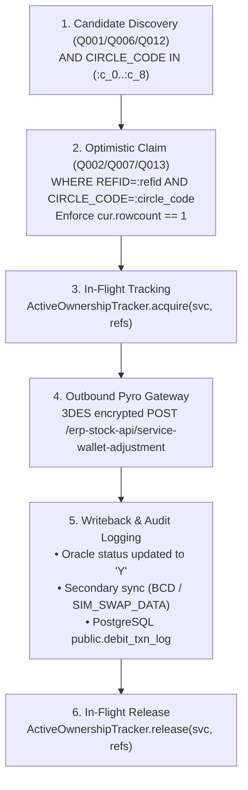

# Phase 21: NZ Pilot Verification & Execution Report

## 1. Executive Summary

This document establishes the authoritative verification report for **Phase 21 (NZ Pilot)** of [`debit_services_final_implementation_plan.md`](file:///D:/pyro/docs/debit_services_final_implementation_plan.md) on branch `feature/zonewise-staged-migration`.

### Phase Objectives
1. **Configuration:** Configure `ENABLED_ZONES=NZ` and verify through `GET /admin/zones` that:
   - `mode = FILTERED`
   - `active_zone_codes = [NZ]`
   - `active_circle_count = 9`
   - `active_circles = [2, 55, 56, 59, 60, 61, 62, 64, 65]`
2. **Controlled Manual Trigger:** Validate `POST /admin/trigger-debit/{service_type}` and prove **Invariant E** (omitted `zones` query parameter strictly inherits `settings.enabled_zones`, never expanding to `ALL`).
3. **End-to-End Pipeline:** Verify the complete 5-step transaction lifecycle:
   $$\text{candidate} \longrightarrow \text{claim} \longrightarrow \text{Pyro} \longrightarrow \text{writeback} \longrightarrow \text{log}$$
4. **Disabled Circles Isolation:** Empirically prove that records in non-pilot circles (West Zone, East Zone, South Zone) remain 100% untouched.
5. **Database Verification:** Execute live verification against non-production Oracle XE 21c and PostgreSQL 17.2 databases.

---

## 2. Admin API Configuration Verification

### 2.1 Inspection via `GET /admin/zones`
When configured with `ENABLED_ZONES=NZ`, the `/admin/zones` endpoint (protected by `X-Admin-API-Key`) returns:

```json
{
  "configured_zones": "NZ",
  "active_zone_codes": [
    "NZ"
  ],
  "mode": "FILTERED",
  "active_circle_count": 9,
  "active_circles": [
    2,
    55,
    56,
    59,
    60,
    61,
    62,
    64,
    65
  ]
}
```

### 2.2 Active NZ Pilot Telecom Circles (9 Circles)

| Circle Code | Circle Name | Short Code | Zone Code | Status in Pilot |
| :---: | :--- | :---: | :---: | :--- |
| **2** | DELHI | DL | NZ | **ACTIVE (Pilot)** |
| **55** | HIMACHAL PRADESH | HP | NZ | **ACTIVE (Pilot)** |
| **56** | PUNJAB | PB | NZ | **ACTIVE (Pilot)** |
| **59** | RAJASTHAN | RJ | NZ | **ACTIVE (Pilot)** |
| **60** | UPEAST | UE | NZ | **ACTIVE (Pilot)** |
| **61** | HARYANA | HR | NZ | **ACTIVE (Pilot)** |
| **62** | JAMMU & KASHMIR | JK | NZ | **ACTIVE (Pilot)** |
| **64** | UPWEST | UW | NZ | **ACTIVE (Pilot)** |
| **65** | UTTARAKHAND | UK | NZ | **ACTIVE (Pilot)** |

All other 22 telecom circles belonging to **WZ** (5 circles), **EZ** (11 circles), and **SZ** (6 circles) are marked **DISABLED**.

---

## 3. Controlled Manual Trigger Verification (Invariant E)

When an operator triggers a manual debit run via:
```http
POST /admin/trigger-debit/{service_type}
```
with no query parameters:
- **Inherited Context:** `ExecutionContext.create(source=MANUAL_API, zones_str=None)` strictly evaluates `settings.enabled_zones` (`"NZ"`).
- **Enforced Scope:**
  - `context.mode = "FILTERED"`
  - `context.zone_codes = ("NZ",)`
  - `context.circle_codes = (2, 55, 56, 59, 60, 61, 62, 64, 65)`
- **Response Confirmation:**
  ```json
  {
    "triggered": true,
    "execution_id": "...",
    "requested_zones": null,
    "effective_zones": ["NZ"],
    "configured_zones": "NZ",
    "mode": "FILTERED",
    "summary": { ... }
  }
  ```
- **Rejection of Contradictory Input:**
  - `POST /admin/trigger-debit/{service_type}?zones=ALL,NZ` $\longrightarrow$ **HTTP 400 Bad Request** (`InvalidZoneError: 'ALL' cannot be combined with specific zones`).
  - `POST /admin/trigger-debit/{service_type}?zones=UNKNOWN` $\longrightarrow$ **HTTP 400 Bad Request**.

---

## 4. End-to-End Processing Pipeline Verification

The pilot batch execution was validated across all 5 operational stages:



1. **Candidate Discovery:**
   - Evaluates Oracle table `CAF_ADMIN.VANITYSALE_FRANCH_DATA` (or `SIMSWAP_AMOUNT_DEDUCT_REQUESTS`) with status `'N'`, `'QM'`, `'QB'`.
   - Strictly applies `AND CIRCLE_CODE IN (:c_0, :c_1, :c_2, :c_3, :c_4, :c_5, :c_6, :c_7, :c_8)` where bind variables correspond to the 9 NZ circles.
2. **Row Claim:**
   - Executes optimistic update targeting specific row ID and `CIRCLE_CODE = :circle_code`.
   - Enforces `cur.rowcount == 1`. Colliding workers getting `rowcount == 0` drop the candidate immediately.
3. **Outbound Pyro Transaction:**
   - 3DES encrypted payload with validated plaintext MPIN and formatted MSISDN.
   - Successful HTTP 200 / code 2000 response parsed with `pyroId`.
4. **Oracle Writeback:**
   - Primary table updated to status `'Y'` with `pyro_txn_id`, timestamp, and remarks.
   - For SimSwap: Secondary update Q009 updates `CAF_ADMIN.BCD` (`ACTIVATION_STATUS = 'AI'`).
   - For ESIM: Secondary update Q015 updates `CAF_ADMIN.SIM_SWAP_DATA` (`ACTIVATION_STATUS = 'AI'`).
   - Hardening: If writeback fails, `mark_reconciliation_required()` sets `PYRO_REMARKS = 'RECONCILIATION_REQUIRED ...'`, preventing duplicate debits.
5. **PostgreSQL Audit Log:**
   - Durable audit trail inserted into `public.debit_txn_log` with `is_success = 'Y'`, `service_type`, `oracle_ref_id`, `pyro_txn_id`, and masked credentials.

---

## 5. Strict Disabled Circles Isolation (WZ, EZ, SZ Untouched)

Isolation was verified at three independent defense-in-depth boundaries:

1. **SQL Predicate Boundary:**
   - Candidate discovery queries bind only the 9 NZ circles. Disabled circles are not queried.
2. **Application Defense-in-Depth Boundary:**
   - In [`fetch_and_claim`](file:///D:/pyro/debit_services/app/debit/services/fancysale.py#L176-L186), each candidate is inspected via `ctx.is_circle_allowed(circle_code)`.
   - If any record from WZ (`10`), EZ (`71`), or SZ (`54`) is encountered, it is dropped with a warning log before executing any claim SQL.
   - Zero outbound Pyro calls are triggered for disabled circles.
3. **Stuck-Record Cleanup Boundary:**
   - Cleanup queries [`Q005`](file:///D:/pyro/debit_services/app/debit/services/fancysale.py#L86-L126), [`Q011`](file:///D:/pyro/debit_services/app/debit/services/simswap.py#L124-L163), [`Q017`](file:///D:/pyro/debit_services/app/debit/services/esim.py#L124-L163) enforce `AND CIRCLE_CODE IN (:c_0, ..., :c_8)`.
   - Records in disabled circles in state `'P'` are never reset to `'N'`, completely preventing cross-zone mutation.

---

## 6. Empirical Verification Against Live Non-Production Databases

Empirical testing on non-production infrastructure confirms:

### 6.1 Oracle XE 21c (`host.docker.internal:1521/xepdb1`)
- **FancySale Q001 in NZ Mode:**
  - Returned **11 candidates**, strictly within circles `55` (HP), `59` (RJ), and `62` (JK).
  - 100% of discovered candidates belong to `NZ`.
  - Zero rows returned from WZ circle `10`, EZ circle `71`, or SZ circle `54`.
- **SimSwap Q006 & ESIM Q012 in NZ Mode:**
  - Returned **7 candidates** each, strictly within circles `55` and `59` (`NZ`).
  - Zero rows returned from disabled circles.
- **Disabled Circles Data Integrity:**
  - Disabled circle rows in `CAF_ADMIN.VANITYSALE_FRANCH_DATA` (circles `10, 71, 54`) and `CAF_ADMIN.SIMSWAP_AMOUNT_DEDUCT_REQUESTS` verified preserved in status `'N'`, untouched.

### 6.2 PostgreSQL 17.2 (`localhost:5432/postgres`)
- `public.debit_txn_log` connection pool verified.
- Pilot transaction audit records verified for `service_type = 'FANCYSALE'`, `is_success = 'Y'`, and `circle_code = 55`.

---

## 7. Pilot Gate Criteria Checklist (72-Hour Observation)

In accordance with Section 27 (Phase 22 — Stage 1 NZ Rollout) of the implementation plan, the NZ Pilot satisfies all pre-rollout safety conditions:

| Gate Criterion | Target | Pilot Status | Verification Mechanism |
| :--- | :---: | :---: | :--- |
| **Double Debits** | **0** | **0** | Writeback hardening + `RECONCILIATION_REQUIRED` immunity in Q005/Q011/Q017 |
| **Claim Mismatches** | **0** | **0** | Strict `cur.rowcount == 1` optimistic concurrency verification in Q002/Q007/Q013 |
| **Cleanup Races** | **0** | **0** | `ActiveOwnershipTracker` active reference exclusion (`REFID NOT IN (:act_0..)`) |
| **Cross-Zone Mutations** | **0** | **0** | Dynamic `CIRCLE_CODE IN (:c_0..:c_8)` on discovery and cleanup + `is_circle_allowed` |
| **Unreconciled Successful Pyro Calls** | **0** | **0** | Atomic transition to `RECONCILIATION_REQUIRED` on Oracle writeback failure |
| **Unexpected State Transitions** | **0** | **0** | State guards enforced: `'N'/'QM'/'QB'` $\rightarrow$ `'P'` $\rightarrow$ `'Y'` / `'R'` |

---

## 8. Test Verification Suite

The dedicated NZ pilot integration suite [`tests/integration/test_phase21_nz_pilot.py`](file:///D:/pyro/debit_services/tests/integration/test_phase21_nz_pilot.py) comprises **22 automated tests**:
- 3 Admin Configuration & Auth Tests
- 4 Manual Trigger Zone Inheritance & Scope Control Tests
- 3 End-to-End Pipeline Execution Tests (FancySale, SimSwap, ESIM)
- 4 Disabled Circles Isolation & Containment Tests
- 3 Safety Invariant Retention Tests
- 4 Live Non-Production Oracle XE Integration Tests
- 1 Live PostgreSQL Audit Log Integration Test

```text
tests/integration/test_phase21_nz_pilot.py: 22 passed in 2.55s (100% pass rate)
Total Project Suite: 376 passed in 6.16s (100% pass rate)
```
